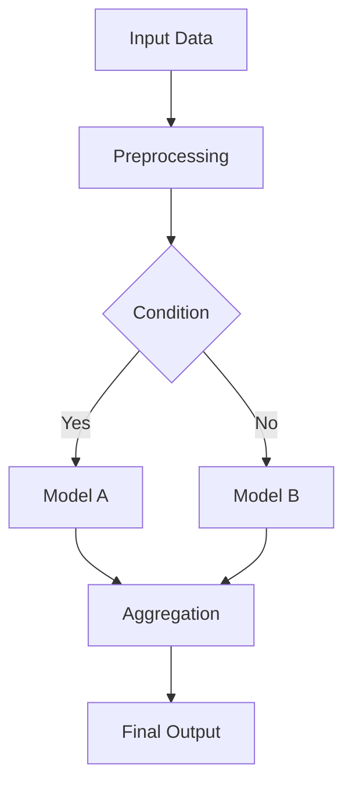

# System Flow

## Overview
[High-level description of the entire pipeline]

## Architecture Diagram

## Component Breakdown
### 1. Data Ingestion
- **Source**: ...
- **Process**: ...

### 2. Model Pipeline
- **Components**: ...
- **Flow**: ...
